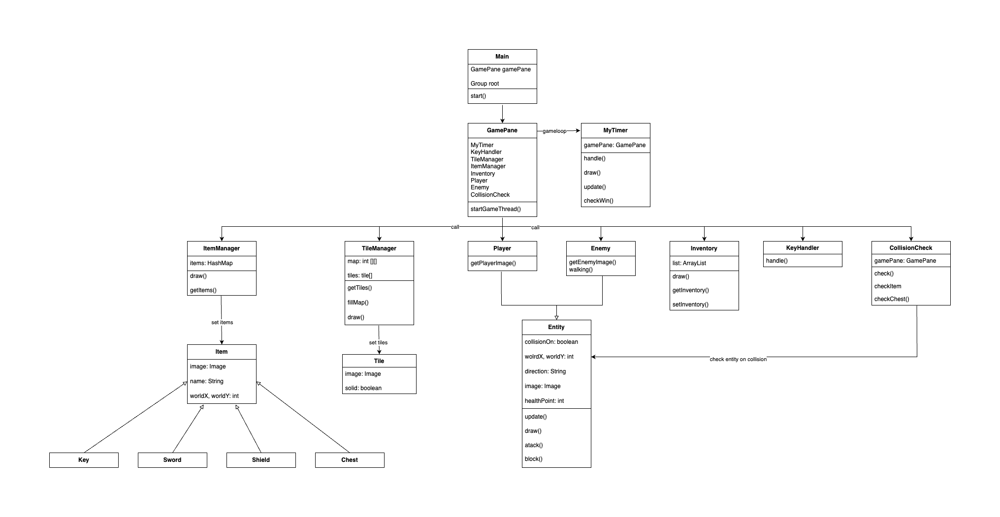

# Role Playing Game

*The game is implemented in java using the javafx library. You are in control of life of a character. To win, you need to collect items, fight orcs and defeat the boss.*

## UML project diagram 



## Rules
1. To move your hero press **W, S, A, D** keys. 
2. To open your inventory press **K** key.
3. To open a chest press **L** key.
4. To attack press **N** key.
5. To defend press **M** key.

## If you want to make your own game
1. Set tiles that you’re gonna use in file **gamedata/maps/tileNum.txt** in the next format: specify the number of tiles in the first line, then each line will contain  an ordinal number, the path to the file with the tile image and the passability (solid / passable). Example:
```
6 
0 tiles/grass.png passable 
1 tiles/earth.png passable 
2 tiles/wall.png solid 
3 tiles/water.png solid 
4 tiles/tree.png solid 
5 tiles/road.png passable

```
2. Then you can set your own map. You can do this with **gamedata/maps/map1.txt**. Create your map using the numbers of tiles from the previous point. Example:
```
0 0 0 0 0 
2 3 3 3 2 
2 1 3 1 2 
5 4 4 4 5 
5 5 5 5 5
```
3. Then you use the file **gamedata/items/itemsInit.txt** to specify which items will be present in your game. To do this, describe the items in the following format: specify the name of the item from the list «key, sword, shield and chest», specify the row and column where you want to place the item and then specify whether the item will be in the chest (true / false). Note that if the item is in the chest, then the coordinates of the item must be negative. Note that chest could be opened only with the key. Example:
```
key 3 3 false 
sword 42 3 false 
chest 40 40 false 
shield -1 -1 true
```
4. To specify entities, use the file **gamedata/entitieslist.txt**. Specify the type of the entity, specify the row and column where you want to place the enemy and specify amount of lives 
```
hero 24 24 5
boss 5 45 3
ork 42 42 2
ork 42 3 2
```

